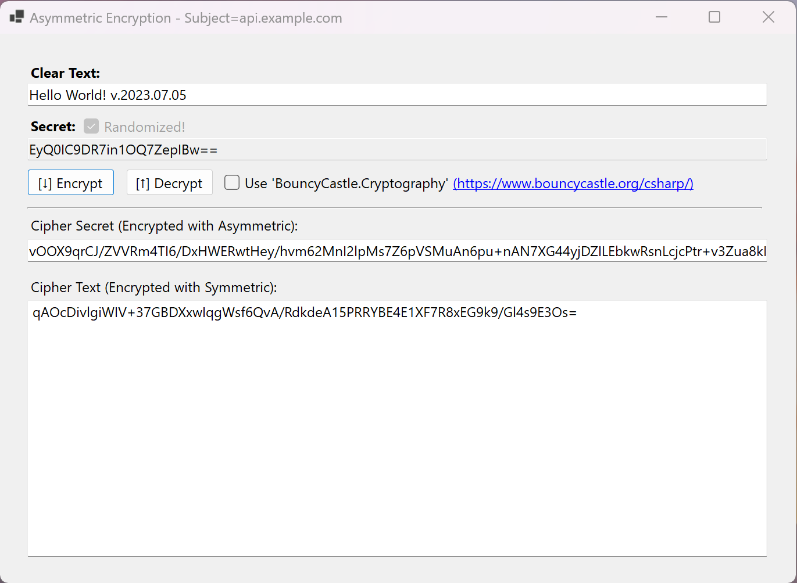

# Cryptography Tester

## Table of Contents

- [Cryptography Tester](#cryptography-tester)
  - [Table of Contents](#table-of-contents)
  - [Description](#description)

## Description

This is a simple cryptography tester that allows you to test the following ciphers:

- Asymmetric
  - RSA
- Symmetric

You can also switch between the following modes:

- [Microsoft CryptoAPI](https://docs.microsoft.com/en-us/windows/win32/seccrypto/microsoft-cryptoapi)
- [Bouncy Castle CryptoAPI](https://www.bouncycastle.org/csharp/index.html)
